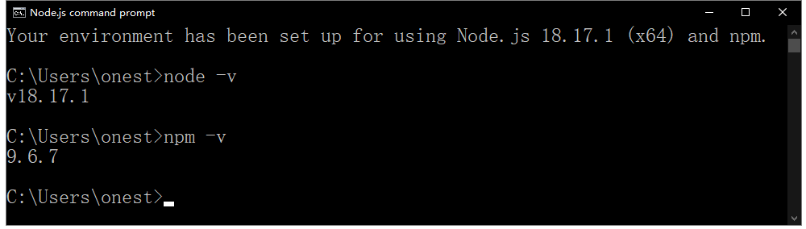

# 第 1 章：JavaScript 概述

## 阅读参考资料

- [JavaScript 概述](https://developer.mozilla.org/zh-CN/docs/Web/JavaScript/Guide/Introduction)

## 搭建开发环境

在 windows 上安装 Node.js

- 下载 [Node.js msi 安装包](https://nodejs.org/dist/v18.17.1/node-v18.17.1-x64.msi)
- 运行 Node.js msi 安装包
- 从开始菜单，运行 `Node.js command prompt`
- 运行命令 `node -v`
- 运行命令 `npm -v`
- 确保软件安装成功，如下图所示

